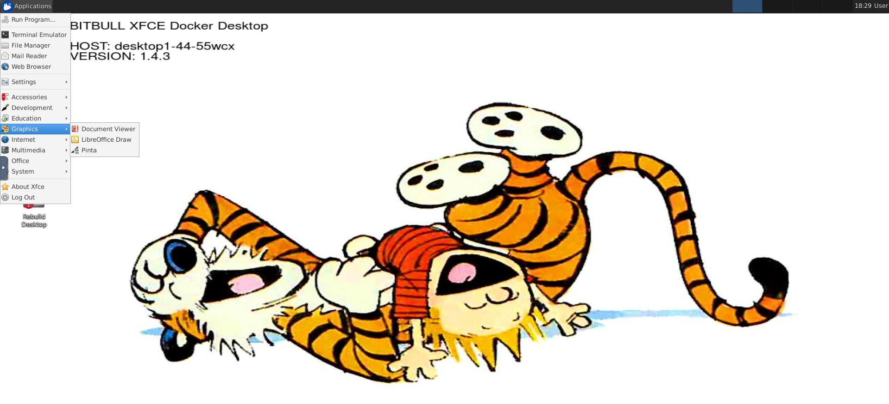

# This image includes the following software
- xfce desktop
- Libre Office
- Terminator
- Visual Studio Code
- Firefox
- Tor Browser
- Git
- OpenSSL
- Nmap
- Tmux


## BUILD
```
vim VERSION
sh build.sh
```

## RUN
```
docker run --env VNC_PW=secure. --env DEBUG=true --publish 5901:5901 --publish 6901:6901 christian773/xfce-vnc:latest
```

## ScreenShot

